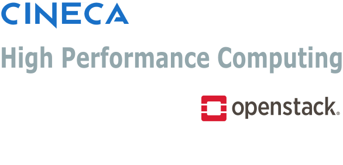

<div align="center">
   
</div>

# Slurm mini-hpc cluster on HPC Cloud 

This repository contains a minimal setup for a Slurm cluster to be deployed on [CINECA HPC Cloud](https://docs.hpc.cineca.it/cloud/general/general_info.html).
It has been tested on ADA Cloud.

## Introduction

Slurm mini-hpc cluster is a lightweight and easy-to-deploy Slurm cluster environment. It is intended for users who need a simple and quick way to set up a Slurm cluster on HPC Cloud.

The idea is to first configure the instances on HPC Cloud using terraform modules (introduced [in this repo](https://gitlab.hpc.cineca.it/adacloud/tf-modules)).
Then we leverage the [ansible-role-openhpc](https://github.com/stackhpc/ansible-role-openhpc) developed by [StackHPC](https://github.com/stackhpc) to install an [OpenHPC](https://openhpc.community/) slurm cluster on the Cloud instances.

## Prerequisites

### OpenStack account on HPC Cloud
Before you start, you need to have an **openstack** account. If you don't have one, please contact CINECA HPC Support [superc@cineca.it](mailto:superc@cineca.it?&subject=Request%20project%20on%20cloud).

### SSH key
You need first to create an ssh key to access the machines. You can use the script [`scripts/sshkeygen.sh`](scripts/sshkeygen.sh). You'll be asked for a tag, choose one and then you can insert the same tag in the `ssh_tag` local variable in your configuration file (see details in the section about customizing the deployment [below](#customizing-the-deployment)).

### Generate the OpenStack Application Credential
You need to generate your personal OpenStack Application Credential. You can refer to [Command Line Interface (CLI) - OpenStack Application Credential creation](https://docs.hpc.cineca.it/cloud/os_overview/management_tools/command_line.html#application-credentials-creation).

## Provisioning
This section will guide you through the process of creating the VMs on HPC Cloud and configuring the cluster.
The cluster structure will have one login node, a customizable number of compute nodes and optionally a separate controller node.
The image of the VMs is Rocky Linux 9.4. 
A shared volume hosting the `/home` partition will also be created.

### Create the VMs
We use Infrastructure as Code (IaC) tools [Terraform](https://www.terraform.io)/[OpenTofu](https://opentofu.org) to provision the infrastructure.
We leverage [terraform modules](https://gitlab.hpc.cineca.it/adacloud/tf-modules) provided by CINECA, which are customized for its platforms.
If not already done, as shown in the [modules repo](https://gitlab.hpc.cineca.it/adacloud/tf-modules), the first time you use CINECA's terraform modules, you need to authenticate to the Gitlab Terraform Registry.
To do so, please create a [GitLab Personal Access Token](https://docs.gitlab.com/user/profile/personal_access_tokens/) (at least `read_api` scope)
and include it in a credentials block in your local `~/.terraformrc` file, as follows:
```
credentials "gitlab.hpc.cineca.it" {
  token = "<TOKEN>"
}
```
For alternative authentication methods, please refer to the official [Gitlab documentation](https://docs.gitlab.com/user/packages/terraform_module_registry/#authenticate-to-the-terraform-module-registry).
For details about IaC you can check [this tutorial](https://gitlab.hpc.cineca.it/adacloud/tf-tutorial).

#### Customizing the deployment
You can check the default variables in the file [`provisioning/variables.tf`](provisioning/variables.tf).
You can override the default variables using a `tfvars` file. A template is provided in [`provisioning/conf/cluster.tfvars.tpl`](provisioning/conf/cluster.tfvars.tpl).
You can copy the template as a new file (for example calling it `provisioning/conf/cluster.tfvars`) and use it to configure the provisioning.
In particular, among the other variables, you can set the number of compute nodes, by default 2, using the variable `num_compute_nodes` or optionally enable the separate controller node by setting the variable `use_separate_controller=true`.

```bash
cd provisioning
terraform init
terraform apply -var-file=conf/cluster.tfvars
```

This will deploy the VMs, the network, the share and everything needed for the hpc mini-cluster.
Additionally, a file `inventory.ini` will be created in the working directory: it will be used in the next step for the OpenHPC ansible installation.

Also, in the terraform output, please note the `login_node_floating_ip` which will be used later to connect to the login node, unless you specify it as mentioned [below](#optionally-select-an-already-allocated-floating-ip-as-login-node-ip).

#### Optionally enable a separate controller node
If the variable `use_external_controller` is set to true, a separate controller node will be created. This node will be used to run the slurm controller services. This is envisioned to be useful both for performance and security reasons given that the controller node is not exposed to the internet.
Moreover, the controller node flavor can be customized by setting the variable `flavor_controller_node`.

#### Optionally select an already allocated floating ip as login node ip
You can use the variable:
```ini
login_node_floating_ip="<your_already_assigned_ip>"
```
to use an already allocated floating ip. This in general can be useful for automation.

#### Choose the type of shared filesystem
The provisioned and configured cluster will have the `/home` partition shared among all the nodes. 
You can choose among three ways of creating the shared filesystem:
- manila share (default)
- cinder volume
- cinder volume encrypted

##### Manila shares
In case of manila share please ensure you are allowed to create generic shares in HPC Cloud.
Follow the guide at the page relative to [creating shares in HPC Cloud](https://docs.hpc.cineca.it/cloud/operative/shares_ops/generic_share_create.html#create-and-use-a-generic-type-share) to be allowed to create **generic** shares in HPC Cloud.

The relevant variables are:
```ini
shared_filesystem_type="manila"
share_size=<desired_shared_size_in_GB>
```

##### Cinder volume
By setting the following variables
```ini
shared_filesystem_type="cinder"
cinder_volume_type="__DEFAULT__"
share_size=<desired_shared_size_in_GB>
```
terraform will create a cinder volume, format it, mount it as `/home`, and export it via NFS. Compute nodes will mount it as `/home` folder as well.

##### Cinder volume encrypted
If you want to create an encrypted cinder volume, set the following variables:
```ini
shared_filesystem_type="cinder"
cinder_volume_type="LUKS"
share_size=<desired_shared_size_in_GB>
```

The main advantage of using cinder volumes is that they can be encrypted by choosing LUKS volume type, since manila shares do not support  encryption at the moment.

## Install slurm
We leverage the [ansible-role-openhpc](https://github.com/stackhpc/ansible-role-openhpc) developed by [StackHPC](https://github.com/stackhpc) to install an [OpenHPC](https://openhpc.community/) slurm cluster on the instances just provisioned.

First install the ansible role:
```bash
cd provisioning
ansible-galaxy role install -fr requirements.yml -p playbooks/roles
```

Then run the playbook with the following command:
```bash
ansible-playbook playbooks/main.yml -i inventory.ini
```

You can finally connect to the login node via its public ip, e.g.:

```bash
ssh -i ~/.ssh/ostack-<ssh_tag>-rsa-key <username>@<login_node_floating_ip>
```

Check the nodes status with `sinfo -N` and launch for example an interactive `srun` job

```bash
srun --pty bash
```

and check the running jobs with `squeue`.


## Author
- [Michele Mastropietro](mailto:m.mastropietro@cineca.it?&subject=Slurm%20mini-hpc%20cluster%20on%20cloud) - Original author 
- [Fabio Pitari](mailto:f.pitari@cineca.it?&subject=Slurm%20mini-hpc%20cluster%20on%20cloud), [Giuseppa Muscianisi](mailto:g.muscianisi@cineca.it?&subject=Slurm%20mini-hpc%20cluster%20on%20cloud), [Lucia Rodriguez Munoz](mailto:l.rodriguezmunoz@cineca.it?&subject=Slurm%20mini-hpc%20cluster%20on%20cloud) - Reviewers 

## Important notice
The code in this repository is property of CINECA released under Apache Licence. It was tested only on [CINECA ADA Cloud](https://docs.hpc.cineca.it/cloud/systems/ada.html).

## Contact
For any request contact CINECA HPC User Support [superc@cineca.it](mailto:superc@cineca.it?&subject=Slurm%20mini-hpc%20cluster%20on%20cloud-repo).
